## z5442708 Ruiyi Yang final report

### Introduction

#### Purpose

This project aims to tell the story of 1) **how Spanish and Italian football teams performed** in top-level league last season (La liga and Serie A), 2) **Players performance** in last season's european champion league 3) Are their some **signing suggestion for Spainish and Italian teams** based on players performance in champion league (since these years Spanish and Italian teams have lost their glory comparing with English teams)

#### Data used

Data are all collected from Kaggle:

- La Liga data: https://www.kaggle.com/datasets/asifsyed1310/la-liga-202122-season-stats
- Serie A data: https://www.kaggle.com/datasets/mechatronixs/20212022-season-italy-seriea-team-datasets?select=SerieA-Team-Standard-Stats.csv
- UCL data: https://www.kaggle.com/datasets/azminetoushikwasi/ucl-202122-uefa-champions-league?select=goals.csv

### Details

#### Data pre-possessing

After downloading the data, the first thing I did is to deal with data, the process includes understanding data, cleaning data, dividing data and reshaping data. (*The pre-possessing precedure is actually the most consuming.*)

##### Understanding data

Breifly speaking, teams data contains following information:

- Teams scoring info (Goals, expected goals, shooting times, etc.)
- Teams attacking info (Assists, expected assist, key passes, etc.)
- Teams passing info (Passes, completion rate, etc.)
- Teams possession info (Possession rate, running distance, etc.)
- Teams defence info (Tackles, fouls, press, etc.)
- Teams goalkeeping info (Conceded, saves, expected scored, etc.)

While players data contains following information:

- Players general info (Age, position, playing times, etc.)
- Attacking related info (Score, assist, key pass, conversion rate, etc.)
- Passing related info (Passing time, completion rate, etc.)
- Defending related info (Tackle, clearance, win ball, etc.)
- Possession related info (Running , pressing, etc.)
- Goalkeeper info (Save, conceded, etc.)

##### Cleaning, dividing and reshaping

To use them in R, I import and reshaped team data into above categories(attack, pass, possess, defense, goalkeeping). For players, I divided the data according to players positions (Forward, midfielder, defender, goalkeeper).

#### Designing

##### Code structure

ui.R only contains all panels structure, details ui code are in server.R, as renderUI and renderPlot output. To make server.R simple, details plotting and ui functions are in plot_func.R. data.R is usde to process data and was sourced in plot_func.R, I think this make it more logical and clear when I need to fix certain bugs

##### Panel design

I used quarter of space on the left as side panel, users can choose data accroding to categories listed. For the rest of the space, I divided them into 3 rows, first one is a main plot, second and third rows are both splited in half to display 4 plots, the whole structures is like：

 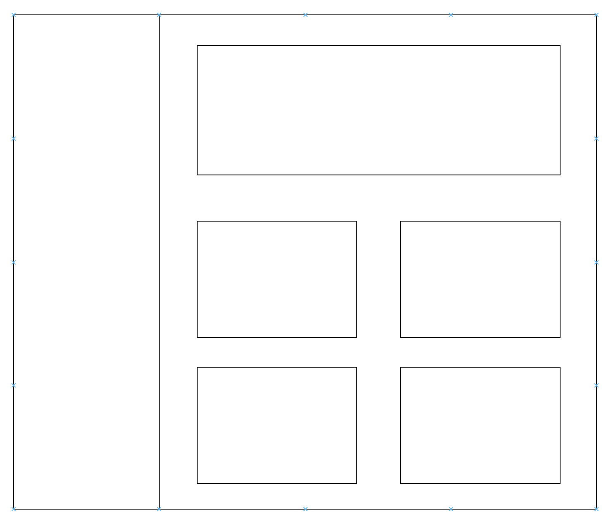

##### Sidepanel design

Sidepanel contains a main Radio and a details Radio, with a total of 8 choices.

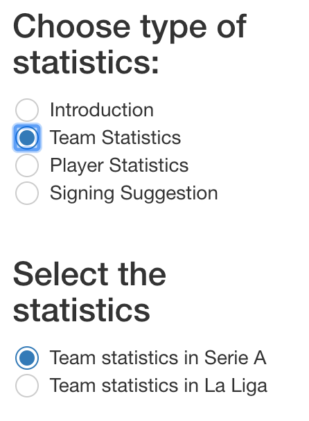

#### Plotting

##### Mainplot-all teams

For the main plot of the total leagues situation, I used stacked column chart to reflect all match results, it looks like

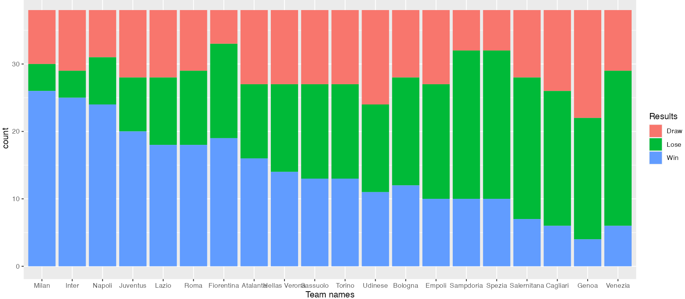

I used position common scale. Towards gestalt principles, I reordering teams accodring to their final points to help see result better. 

##### Mainplot-radar chart

I used radar chart to reflect single entity's performance. For a team, I consider it general statistics, for players, I consider their data most needed according to their position, take a defender, for example, his radar chart is like:

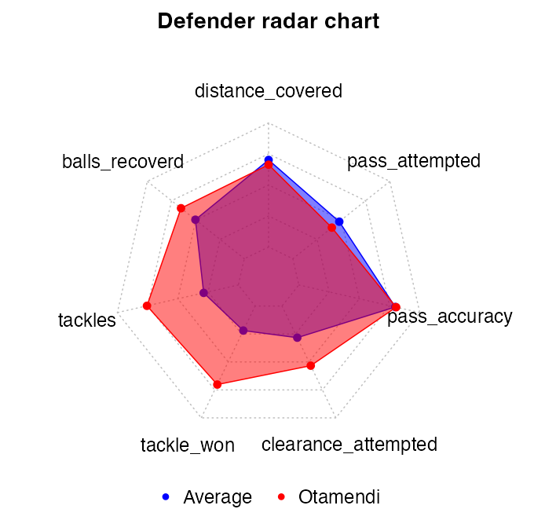

I used position non-aligned scale to fit all variables in a certain radar plot. To help compare better, I also add an average data. On the radar chart, the outside boundary is the max value, while the inside boundary is the min value. Points are connected to help better forming a brief outlook of players data.

When I need to compare two players, it's also intuitive adding another color on radar chart:

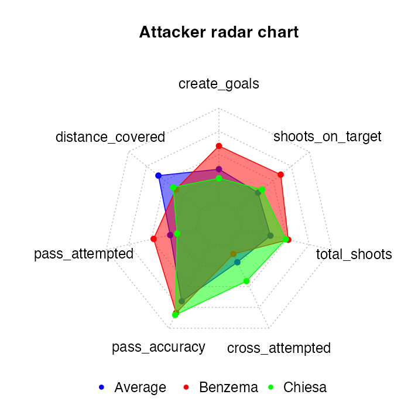

Using `alpha=0.5` and three colors that forms contrast, users can clearly have a rough impression on two players attacking data as well as their data comparing with average value. From the chart we can see that Chiesa tried more at crossing, while Benzema;s main responsibility is shooting and score.

##### Other plots-scatter

I also used scatter plot to reflect a player/ team's certain data, for example, Benzema's score data:

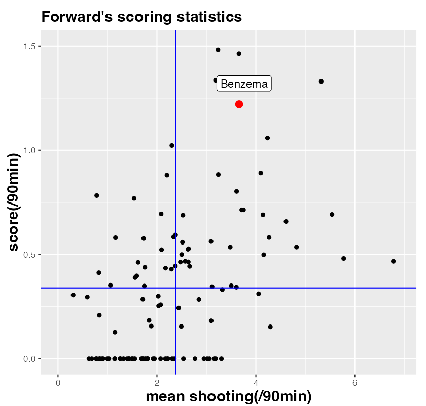

In the position common scale, I added two lines in the graph, the intercept of two axes are players average data. In this way the plot is devided into 4 parts, to reflect  (many/little) chances and (high/low) score ability. We can see from above plot, Benzema created many chances, and is of high scoring ability.

The above four part division is also useful when comparing players, like below:

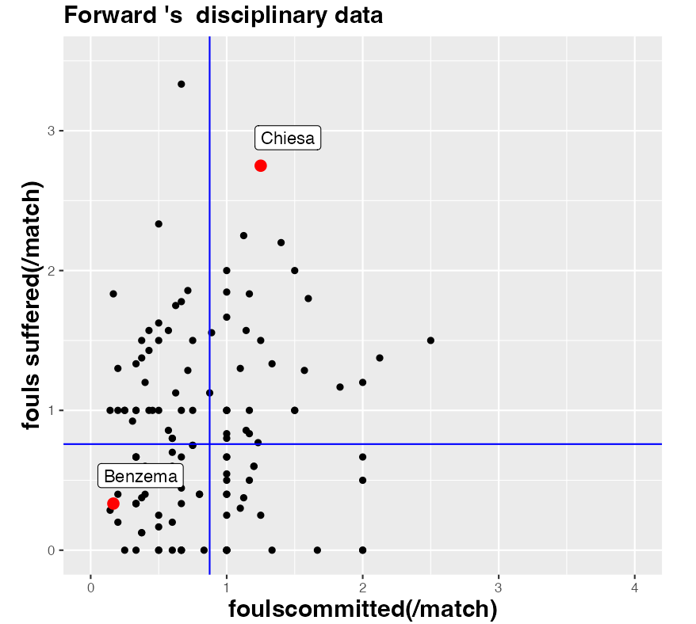

In the disciplinary data, the scatter plot is divided into four parts, implying whether a player is prone to commit/suffer fouls. Benzema is more disciplinary than Chiesa, but Chiesa can also attract opponents committing more fouls. *Lines, red points and labels* make users easy to locate players and compare.

Sometimes the plot only contains one numeric variable(like possession), I still choosed scatter plot like below:

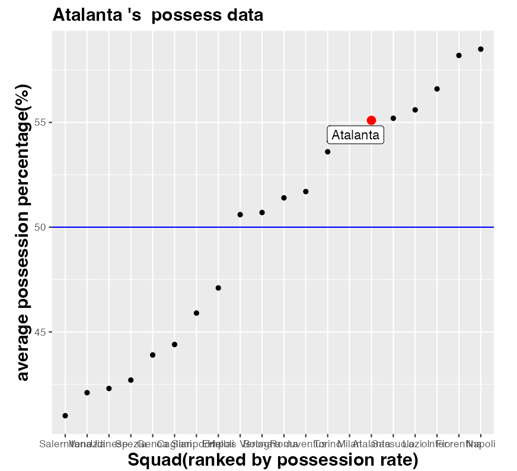

Using position common scale, I first sort teams according to their possession rate, a horizontal line of **y=50** is added as a criteria and separate teams into two parts: high/low possession.

##### Other plot-column chart

When user needs to compare one teams detail data, for example, Attack, I choosed column chart like below:

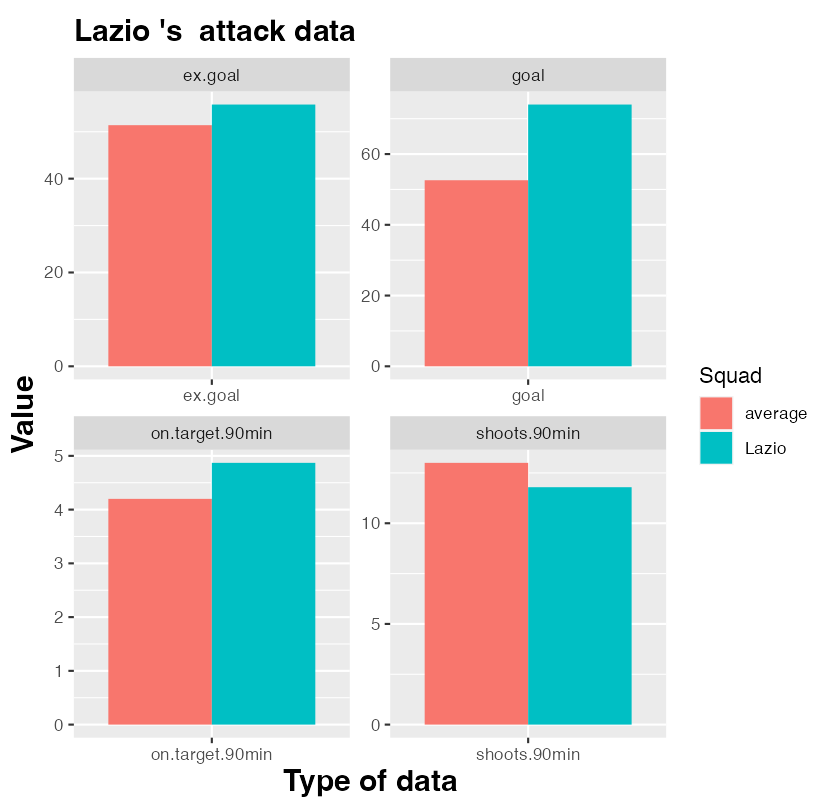

Using `facet_wrap()`, I separately charts for each variables, comparing it with average value using position common scale. It's intuitive to see that **Lazio** has relatively *less* shooting, but has extremely *high* score efficiency.

Also, for teams potential signing, it looks like this:

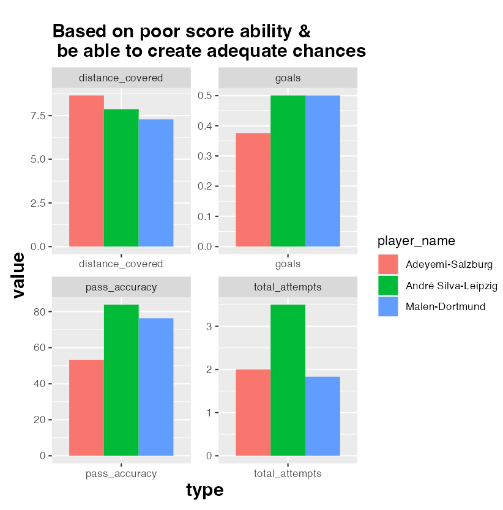

`facet_wrap()` separately divided the long dataframe according to variable names. In the position common scale and red-green-blue color, three players formed strong contrast, to help better compare their data.

### Conclusion

This shiny app offered both brief and detail data visulization of teams and players performance last season, users can search & compare info of their favorite teams and players. Based on Spanish and Italian teams performance, I also added some signing suggestion while visulized and compared recommended players' data. Most plots followed position common scale. Gestalt principles are followed like color, continuity and connectedness. Here are some of the final project screenshots:

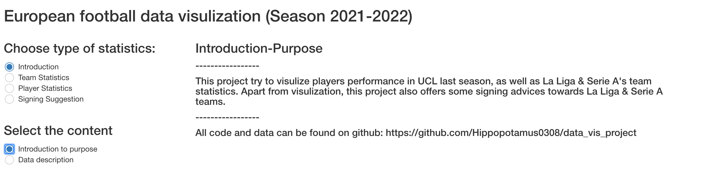

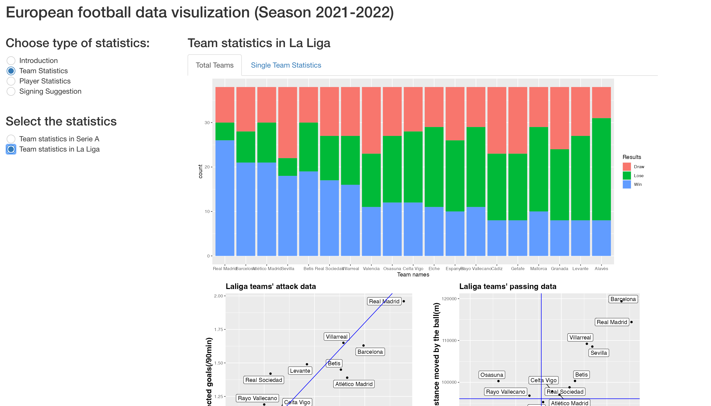

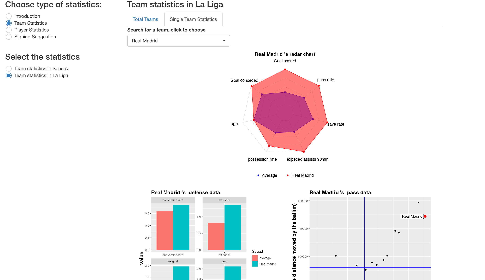

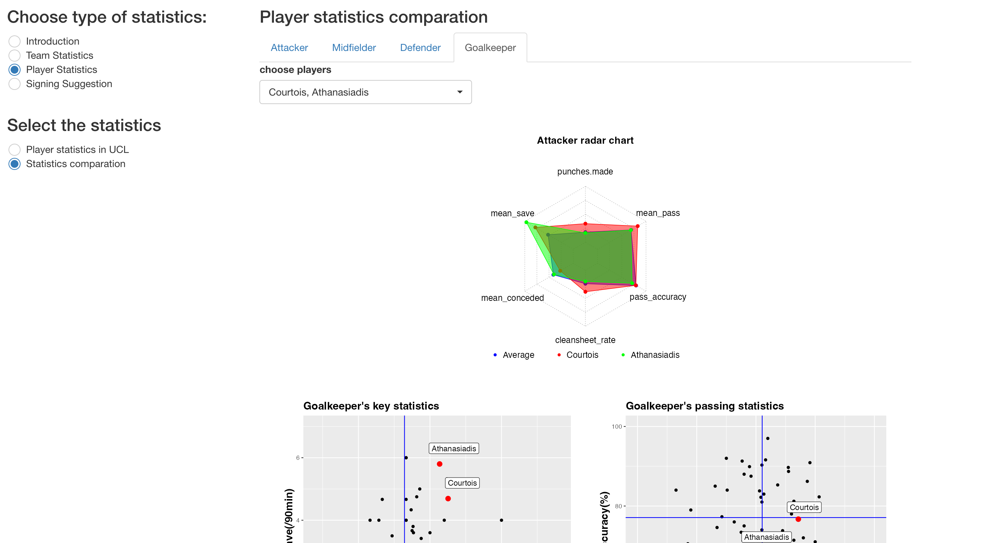

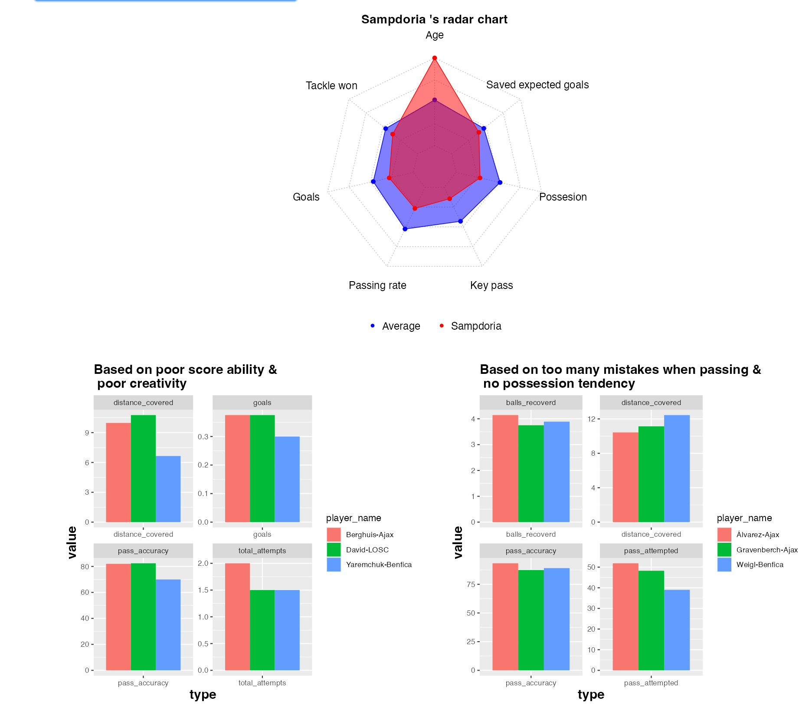
